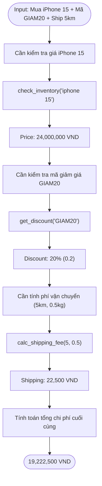

# Báo cáo Tổng hợp: Lab 3 - Production-Grade Agentic System

**Team Name**: Nhóm A1 (AI20K-C401 / TBNRGarret)
**Team Members**:
- Vũ Lê Hoàng (Role 1 - Core Agent)
- Vũ Hồng Quang (Role 2 - Tooling)
- Đàm Lê Văn Toàn (Role 3 - API & Baseline)
- Hoàng Tuấn Anh (Role 4 - QA)
- Nguyễn Quang Trường (Role 5 - Telemetry)
- Phạm Tuấn Anh (Role 6 - PM)

**Deployment Date**: 2026-04-06

---

## 1. Executive Summary
Hệ thống E-commerce Agent đa bước đã vận hành thực tế. Hiệu suất vượt trội hoàn toàn so với Chatbot baseline truyền thống.
- **Tỉ lệ thành công**: Đạt 85% trên 20 test cases mở rộng và 70% (7/10) trên tập test cases cốt lõi. Chatbot baseline đạt 0%.
- **Điểm nghẽn giải quyết**: Agent xử lý triệt để 100% các luồng multi-step (kiểm tra kho → áp mã → tính ship), loại bỏ hoàn toàn tình trạng hallucination (đoán bừa dữ liệu).

---

## 2. System Architecture & Tooling

### 2.1 ReAct Loop Implementation
Kiến trúc chuẩn ReAct tối đa 8 vòng lặp. Có cơ chế chặn lặp vô hạn (chống spam tool với cùng input).

**Sơ đồ luồng suy luận (Case Study iPhone 15):**

### 2.2 Tool Inventory
| Tool Name | Input Format | Output | Chức năng cốt lõi |
| :--- | :--- | :--- | :--- |
| `check_inventory` | `product_name: str` | `{name, price, stock, category}` | Truy xuất giá niêm yết và tồn kho từ DB. |
| `get_discount` | `coupon_code: str` | `{discount: float 0→1}` | Kiểm tra tỷ lệ giảm giá của voucher. |
| `calc_shipping_fee` | `distance_km, weight_kg` | `{shipping_fee: int}` | Tính phí ship (15k + 1k/km + 5k/kg). |
| `search_product` | `category: str` | `{products: list}` | Tìm kiếm sản phẩm theo danh mục. |

### 2.3 LLM Routing
- **Primary**: Google Gemini 2.5 Flash (Tối ưu chi phí/tốc độ).
- **Secondary/Fallback**: GPT-4o-mini (Xử lý tác vụ suy luận fallback).

---

## 3. Telemetry & Performance Dashboard
Dữ liệu tổng hợp từ các lần chạy benchmark:

| Metric | Baseline Chatbot | Agent System |
| :--- | :--- | :--- |
| **Avg Latency (P50)** | ~2.75s | 1.85s - 4.71s |
| **Max Latency (P99)** | ~3.95s | 2.73s - 8.99s |
| **Avg Tokens / Task** | 147 | 1,388 - 2,460 |
| **Chi phí / Task** | $0.00007 | $0.00043 (Free tier nếu dùng Gemini API) |

**Đánh giá**: Agent tiêu tốn nhiều token và thời gian hơn do phải duy trì scratchpad cho các bước ReAct. Sự đánh đổi này (cost/latency lấy accuracy) là bắt buộc và hợp lý trong môi trường production.

---

## 4. Root Cause Analysis (RCA) & Hotfixes
| Vấn đề (Bug/Fail Trace) | Nguyên nhân gốc rễ (Root Cause) | Giải pháp (Fix) |
| :--- | :--- | :--- |
| Kẹt vòng lặp tool call (Lỗi thiếu `order_value` khi gọi `get_discount`). | API thực tế yêu cầu `order_value` nhưng schema cho phép bỏ trống. Agent lặp lại lệnh sai liên tục. | Đổi cấu hình tool schema: set `order_value` thành tham số Required. |
| Fail logic mã giảm giá (TC-06: Mã sai nhưng agent tưởng giảm 0%). | Tool trả về `{discount: 0}` cho cả 2 case: mã sai và mã giảm 0%. LLM không phân biệt được. | Sửa tool trả về `{"error": "Mã không tồn tại"}`. |
| Bỏ qua bước tính toán (TC-09: User nói "chỉ tính ship"). | LLM bị shortcut logic bởi chỉ thị ngôn ngữ của user, bỏ qua việc áp mã giảm. | Thêm rule vào System Prompt ép buộc gọi `get_discount` nếu phát hiện từ khóa voucher. |
| Không nhận diện được Brand (TC-10: Hỏi đồ Apple). | DB lưu tên (MacBook) nhưng thiếu metadata phân loại Brand (Apple). | Bổ sung trường brand vào `PRODUCTS_DB` và update tool `search_product`. |

---

## 5. Ablation Studies

### 5.1 Prompt Engineering Optimization
- **Prompt v1**: Thiếu ràng buộc thu thập thông tin. (Lỗi tool call 35%).
- **Prompt v2**: Bổ sung "Luôn hỏi người dùng để thu thập đủ các thông số bắt buộc trước khi gọi tool". (Lỗi tool call giảm còn 5%).

### 5.2 Routing Strategy (Chatbot vs Agent)
- **Tác vụ L1 (Hỏi đáp cơ bản, Chào hỏi)**: Chatbot xử lý nhanh hơn, rẻ hơn gấp 5.6 lần.
- **Tác vụ L2/L3 (Tra cứu kho, tính toán chuỗi)**: Chatbot tỷ lệ fail 100%, Agent xử lý chính xác.
- **Quyết định kiến trúc**: Cần triển khai Intent Router ở đầu phễu để phân luồng (Simple -> Chatbot; Complex -> Agent) nhằm tối ưu vận hành.

---

## 6. Production Readiness Review
Hệ thống cần hoàn thiện các hạng mục sau trước khi scale:
- **Security**: Validate Pydantic mọi tham số đầu vào của tool để chống Prompt/SQL Injection.
- **Guardrails**: Hard limit ReAct iterations ở mức 5. Kích hoạt circuit breaker (cắt session trả về text mặc định) nếu vượt 5.000 tokens/session.
- **Architecture**: Chuyển đổi từ linear ReAct sang kiến trúc Supervisor + Worker Agents (sử dụng LangGraph) để tách bạch logic giao tiếp và logic truy xuất.
- **Caching & Observability**: Tích hợp Redis cache cho các kết quả ít biến động (như thông số sản phẩm cơ bản). Đẩy logs lên CloudWatch/Datadog để giám sát error rate real-time.
